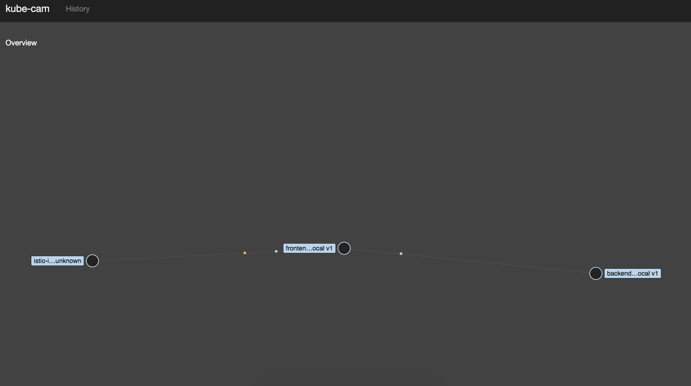

# kube-cam [](https://travis-ci.com/setttings/kube-cam)

Disclaimer: No identification with actual persons (living or deceased), places, buildings, and products is intended or should be inferred.

## What's Included
* Monitoring of traffic in an Istio-enabled Kubernetes cluster
* Modify routing between cluster services



## Getting Started

These instructions will get you a copy of the project up and running on your local machine for development and testing purposes. See deployment for notes on how to deploy the project on a live system.

### Prerequisites

What you need to install the software and how to install them

* [Kubernetes + Istio](https://istio.io/)
* [Node.js](https://nodejs.org/en/)

### Installing

Set up a Kubernetes cluster with Istio installed and deploy your application with Istio sidecars.

See the [Istio documentation](https://istio.io/docs/setup/kubernetes/quick-start.html) for detailed instructions and the [sample application](sample) for an example of how to deploy a sample application.

Install the Prometheus add-on for Istio.

```
kubectl apply -f install/kubernetes/addons/prometheus.yaml
```

#### Setting up the kube-cam backend

Setup a proxy to the Kubernetes API.
```
kubectl proxy --port=8081 &
```

Setup port-forwarding for Prometheus.

```
kubectl -n istio-system port-forward $(kubectl -n istio-system get pod -l app=prometheus -o jsonpath='{.items[0].metadata.name}') 9090:9090 &
```

Start the backend application.

```
cd backend

npm install

npm run dev
```

#### Setting up the kube-cam frontend

Setup port-forwarding for Prometheus.

```
kubectl -n istio-system port-forward $(kubectl -n istio-system get pod -l app=prometheus -o jsonpath='{.items[0].metadata.name}') 9090:9090 &
```

Start the kube-cam application.

```
npm install

npm run dev
```

Visit [http://localhost:8080](http://localhost:8080) in your browser.

## Testing

### E2E tests

```
npm test
```

### Style

```
npm run lint
```

## Deployment (tbd)

Build and tag the Kube-Cam image.

```
docker build -t kube-cam:v2 . && docker tag kube-cam:v2 us.gcr.io/dev-619/kube-cam:v2
```

Push the image to some container registry.

```
gcloud docker -- push us.gcr.io/dev-619/kube-cam:v2
```

Deploy Kube-Cam in a Kubernetes cluster.

```
kubectl apply -f config/kube-cam.yaml
```

Set up port-forwarding for the Kube-Cam application.

```
kubectl port-forward $(kubectl get pod -l app=kube-cam -o jsonpath='{.items[0].metadata.name}') 8080:8080 &
```

Visit http://localhost:8080 in your web browser.

## Built With
* Stress
* [Structured procrastination](http://www.structuredprocrastination.com/)

## Contributing

We love your input! We want to make contributing to this project as easy and transparent as possible, whether it's:

- Reporting a bug
- Discussing the current state of the code
- Submitting a fix
- Proposing new features
- Becoming a maintainer

### Pull Requests
Pull requests are the best way to propose changes to the codebase (we use [Github Flow](https://guides.github.com/introduction/flow/index.html)). We actively welcome your pull requests:

1. Fork the repo and create an appropriately named branch from `master`.
2. If you've added code that should be tested, add tests.
3. If you've changed APIs, update the documentation.
4. Ensure the test suite passes.
5. Make sure your code lints.
6. Issue that pull request!

### Issues
We use GitHub issues to track public bugs. Report a bug by opening a new issue. **Great Bug Reports** tend to have:
- A quick summary and/or background
- Steps to reproduce
  - Be specific!
  - Give sample code if you can.
- What you expected would happen
- What actually happens
- Notes (possibly including why you think this might be happening, or stuff you tried that didn't work)

### Use a Consistent Coding Style
* 2 spaces for indentation rather than tabs
* Running `npm run lint` for style unification

## Versioning

We use [SemVer](http://semver.org/) for versioning. For the versions available, see the [tags on this repository](https://github.com/setttings/kube-cam/tags).

## License

This project is licensed under the MIT License - see the [LICENSE](LICENSE) file for details

## Acknowledgments

* Cameron: "I'd be flattered if this was named after me"
